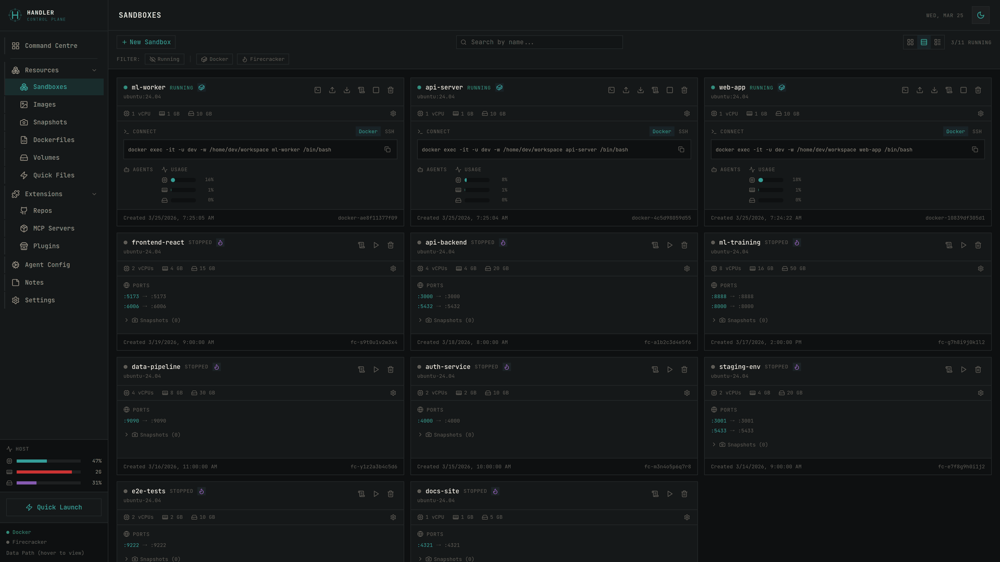
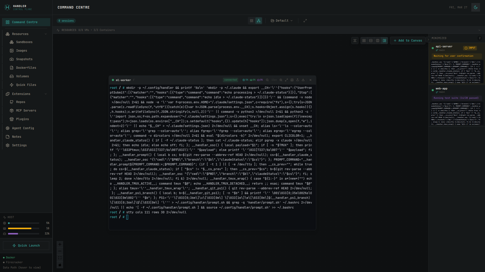
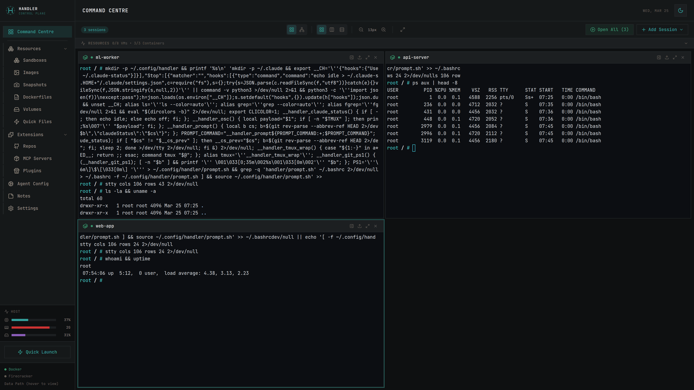
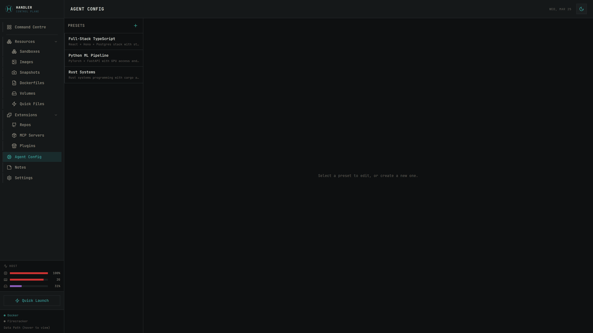
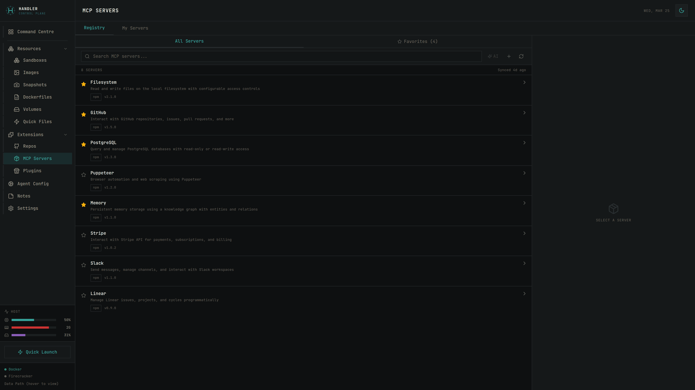

<p align="center">
  
</p>

<h1 align="center">Handler</h1>

<p align="center">
  <strong>Sandbox infrastructure for AI agents.</strong><br/>
  A self-hosted control plane for spawning isolated compute environments — Docker containers, Firecracker microVMs, and cloud VMs — through one unified API and UI.
</p>

<p align="center">
  <a href="#why">Why</a> •
  <a href="#quick-start">Quick Start</a> •
  <a href="#highlights">Highlights</a> •
  <a href="#architecture">Architecture</a> •
  <a href="#api-reference">API</a>
</p>

---



## Why

AI coding agents want to execute code. Giving them a shell on your laptop is a bad idea; giving them an unbounded cloud API key is a worse one. What they actually need is a **sandbox** — fast to spawn, cheap to throw away, isolated from everything that matters.

Handler is a self-hosted control plane for those sandboxes. It treats Docker containers, Firecracker microVMs, and cloud VMs as one abstraction, with a unified API, terminal, file browser, and canvas workspace on top — built for supervising many concurrent agent sessions at once.

## Quick start

```bash
git clone https://github.com/Launchable-AI/handler.git
cd handler
pnpm install
pnpm dev
```

Open [http://localhost:5173](http://localhost:5173). Requires **Node 22+**, **pnpm**, and **Docker**.

To also enable Firecracker microVMs on Linux (optional):

```bash
sudo ./scripts/setup.sh     # installs TAP helper, bridge, Firecracker, base image
./scripts/status.sh         # verify
```

## Highlights

A few things Handler does that are hard or tedious to do yourself:

- **Firecracker microVMs that boot in under 5 seconds** — Custom kernel, ACPI boot, overlay-on-overlay avoidance via a dedicated Docker volume, pre-boot overlay injection via `debugfs` (no loop-device overhead), graceful shutdown that stops containers cleanly to avoid boot-time networking hangs.
- **Docker inside Firecracker** — Full Docker CE with `overlay2` storage driver working natively (avoiding nested overlayfs), via dedicated ext4 block device allocation and a containerd bind mount trick.
- **Persistent tmux sessions** — Every terminal is a tmux session that survives WebSocket disconnects, server restarts, and page reloads. Multiple canvas nodes on the same VM each get their own tmux session with automatic slot allocation.
- **Canvas workspace** — ReactFlow-based visual layout for supervising multiple concurrent agent sandboxes. Spatial keyboard navigation, focused-window mode, git worktree forking ("Fork"), VM cloning ("Clone"), and drag-and-drop tab assignment.
- **AI-classified terminal activity** — A small, cheap LLM reads each terminal's tail output and classifies the session as `needs_input` / `working` / `error` / `done` / `idle`. Colored status indicators surface which sandbox needs your attention without you having to look inside each one.
- **Unified file browser** — Upload, download, and browse files across any backend via one API. Docker uses `docker cp`; VMs use SCP; cloud VMs use backend-specific SSH.
- **Security hardening by default** — API bound to `127.0.0.1` only, firewall rules to block guest-to-host access, shell-free command execution (`execFileSync` with argument arrays, no interpolation), input validation at every boundary.
- **VM disk compaction on stop** — `zerofree` + `fallocate --dig-holes` reclaim space from the host's sparse ext4 backing files, since Firecracker's virtio-blk doesn't pass DISCARD through to the host.
- **Agent detection** — Detects Claude Code, Codex, Gemini CLI, and OpenCode running inside sandboxes via `pgrep`-based heuristics, with colored status badges.
- **MCP server registry** — Register, configure, and deploy Model Context Protocol servers per sandbox.

By the numbers: two hypervisor backends (Docker, Firecracker) + six cloud backends (AWS, GCP, Azure, DigitalOcean, Linode, Daytona), all behind one `SandboxAdapter` interface. ~100 server tests + ~43 web tests passing. TypeScript throughout, strict mode, zod validation at HTTP boundaries. MIT licensed, no phoning home.

### A quick tour

**Canvas workspace** — supervise many agents at once, with live terminal previews, AI-classified status, and keyboard-driven navigation.



**Terminals** — xterm.js + tmux, with reconnect-on-refresh and per-session theming.



**Agent presets** — pre-bake API keys, MCP servers, and setup commands into reusable agent configs that get injected on sandbox creation.



**MCP server registry** — browse, configure, and deploy Model Context Protocol servers into any sandbox.



## Firecracker setup (details)

If you ran `sudo ./scripts/setup.sh` in the Quick Start, skip this section.

The setup script:
- Installs the `handler-tap-helper` Rust binary with `CAP_NET_ADMIN` for non-root TAP device creation
- Creates a `handler-br0` bridge with NAT so VMs get internet
- Installs Firecracker and downloads an Ubuntu 24.04 base image
- Registers a systemd unit so networking survives reboots

To uninstall: `sudo ./scripts/uninstall.sh` (or `--keep-data` to preserve VMs).

## Usage

### Create a container
1. Click **+ New Container** in the Sandboxes tab
2. Pick a base image (the default ships with OpenCode pre-installed)
3. Optionally attach a volume and/or forward ports
4. **Create**

### Connect to a container
- **Quick**: copy the `docker exec` command from the sandbox card
- **SSH**: download the generated keypair, then `ssh -i ~/.ssh/<name>.pem -p 2222 dev@localhost`

### Create a VM
1. Ensure `sudo ./scripts/setup.sh` has run once
2. Click **+ New VM**, pick a base image, set resources (vCPUs / memory / disk), **Create**
3. VM boots in ~5s and gets an IP on `172.31.0.0/24`

### Canvas workspace
The canvas is for when you have multiple sandboxes running simultaneously — typically several agents working on different branches of the same repo. Drop a sandbox onto the canvas to get a live terminal node. Fork a VM into a worktree to give two agents the same starting point on different branches. Use `Alt+↑/↓/←/→` to navigate between nodes, `Alt+Enter` to focus one, `Alt+M` to minimize.

## Architecture

### Adapter pattern

All sandbox operations go through a single `SandboxAdapter` interface implemented once per backend. The `SandboxService` coordinator dispatches based on the sandbox's `backend` discriminator.

```
SandboxService
├── DockerAdapter        (local Docker)
├── FirecrackerAdapter   (local Firecracker microVMs)
├── AwsAdapter           (EC2 instances)
├── AzureAdapter         (Azure VMs)
├── GcpAdapter           (GCE instances)
├── DigitalOceanAdapter  (Droplets)
├── LinodeAdapter        (Linode instances)
└── DaytonaAdapter       (Daytona cloud workspaces)
```

Each adapter is a thin shell over a dedicated backend service (e.g. `firecracker.ts`, `docker.ts`) where the hard work lives. Adding a new backend is a matter of implementing the adapter interface.

### Tech stack

- **Server**: Node.js 22, Hono, `dockerode`, raw Firecracker API over unix socket, `ws` for WebSocket terminal I/O, `zod` for input validation
- **Web**: React 19, Vite, Tailwind CSS v4, TanStack Query, `xterm.js` for terminals, `ReactFlow` for canvas
- **Storage**: JSON files in `data/` for sandbox metadata, sparse ext4 images for VM disks, tmux for session persistence
- **Networking**: Rust `handler-tap-helper` binary creates TAP devices with `CAP_NET_ADMIN`; VMs bridge to `handler-br0`
- **Monorepo**: pnpm workspaces

### Project layout

```
├── packages/
│   ├── server/          # Hono backend
│   │   └── src/
│   │       ├── routes/          # HTTP endpoints (sandboxes, containers, vms, …)
│   │       ├── services/
│   │       │   ├── sandbox/     # Unified SandboxService + adapters
│   │       │   ├── volume/      # Unified volume service
│   │       │   ├── template/    # Dockerfile/image management
│   │       │   ├── firecracker.ts
│   │       │   ├── docker.ts
│   │       │   ├── terminal.ts        # tmux-backed Docker terminals
│   │       │   ├── vm-terminal.ts     # tmux-backed VM terminals
│   │       │   ├── terminal-summary.ts # AI-classified activity
│   │       │   ├── guest-metrics.ts    # CPU/mem/disk from inside guests
│   │       │   ├── agent-detect.ts     # Detect AI coding agents in sandboxes
│   │       │   └── …
│   │       ├── lib/
│   │       │   ├── safe-exec.ts       # Shell-free command execution
│   │       │   ├── validation.ts      # Boundary input validators
│   │       │   └── exec-in-sandbox.ts # Backend-agnostic remote exec
│   │       └── types/           # Shared types + zod schemas
│   └── web/             # React frontend
│       └── src/
│           ├── api/             # API client (one file, all endpoints)
│           ├── components/
│           │   ├── sandbox/     # Sandbox list / card / create / file browser
│           │   ├── Terminal/    # xterm.js + WebSocket integration
│           │   ├── CommandCentre/ # Canvas workspace (ReactFlow)
│           │   └── settings/
│           ├── hooks/           # React Query hooks
│           ├── lib/             # keyboard-shortcuts, terminal-themes, prompt-themes
│           └── context/
├── helpers/
│   └── tap-helper/              # Rust TAP device helper
├── scripts/
│   ├── setup.sh                 # One-shot host setup
│   ├── uninstall.sh
│   ├── status.sh
│   └── user/                    # Install scripts (end users)
│   └── dev/                     # Maintainer scripts (image builders)
├── guest-init/                  # Scripts baked into VM images
└── CLAUDE.md                    # Deep architecture notes (recommended read)
```

For a deeper tour of the harder pieces — Firecracker boot optimization, Docker-in-VM plumbing, tmux session model, security hardening — see [CLAUDE.md](CLAUDE.md).

## API reference

The API is intentionally small and discoverable. All routes are under `/api`.

### Sandboxes (unified)

| Method | Endpoint | Description |
|--------|----------|-------------|
| GET | `/sandboxes` | List across all backends. Filters: `?backends=docker,firecracker&status=running` |
| POST | `/sandboxes` | Create (body: `{ backend, name, image, … }`) |
| GET | `/sandboxes/:id` | Get details |
| POST | `/sandboxes/:id/start` | Start |
| POST | `/sandboxes/:id/stop` | Stop |
| DELETE | `/sandboxes/:id` | Delete |
| GET | `/sandboxes/backends` | Available backends |
| GET | `/sandboxes/:id/logs` | Get logs |
| GET | `/sandboxes/:id/logs/stream` | Stream logs (SSE) |
| GET | `/sandboxes/:id/metrics` | Live CPU/mem/disk |
| GET | `/sandboxes/:id/agents` | Detected AI agents |
| GET | `/sandboxes/:id/terminal-summary` | AI-classified activity |
| GET | `/sandboxes/:id/tmux-sessions` | List existing tmux sessions |
| GET | `/sandboxes/:id/files?path=...` | List files |
| GET | `/sandboxes/:id/files/download?path=...` | Download a file |
| POST | `/sandboxes/:id/upload` | Upload a file |
| POST | `/sandboxes/:id/upload-directory` | Tar-based batch upload |
| GET | `/sandboxes/:id/ssh-key` | Download SSH private key |

### Other resources

| Group | Endpoints |
|-------|-----------|
| **VMs** | `/api/vms` — create/start/stop/delete Firecracker VMs, base-image management |
| **Templates** | `/api/templates` — Dockerfile + VM image templates with multi-backend builds |
| **Volumes** | `/api/volumes`, `/api/unified-volumes` — persistent storage across backends |
| **Quick Files** | `/api/quick-files` — reusable files auto-injected on sandbox creation |
| **Worktrees** | `/api/worktrees/fork`, `/worktrees/clone` — git worktrees + VM cloning |
| **MCP** | `/api/mcp` — Model Context Protocol server registry |
| **Notes** | `/api/notes` — per-sandbox notes |
| **GitHub** | `/api/github` — GitHub App integration |
| **SSH Keys** | `/api/ssh-keys` — VM keypair management |
| **System** | `/api/health`, `/api/config` |

## WebSocket

Terminal I/O, VM console, and session events flow over `/ws/terminal`. The protocol is a small JSON envelope (`start`, `start-vm`, `input`, `resize`, `kill`, etc.) with binary payloads for terminal output. See `packages/server/src/index.ts` for the message handlers.

## Security

Handler is hardened against malicious code running inside sandboxes attempting to exploit the control plane:

1. **Network isolation**: HTTP server binds to `127.0.0.1` only, so Docker bridges and VM TAP interfaces cannot reach it. `scripts/setup.sh` adds defense-in-depth iptables rules.
2. **No shell interpolation**: All command execution uses `execFileSync` with argument arrays (`packages/server/src/lib/safe-exec.ts`). No user input is ever passed to a shell.
3. **Boundary validation**: Sandbox IDs, paths, filenames, and IP addresses are validated via dedicated zod-backed validators (`packages/server/src/lib/validation.ts`) before reaching execution code.

Found a vulnerability? See [SECURITY.md](SECURITY.md).

## Troubleshooting

```bash
./scripts/status.sh                # full setup + installation state
```

**"KVM not available"** — virtualization disabled in BIOS, or `/dev/kvm` missing.
**"Permission denied" for KVM** — `sudo usermod -aG kvm $USER` and re-login.
**"Bridge not found"** — run `sudo ./scripts/setup.sh`.
**"TAP helper missing capabilities"** — reinstall: `sudo ./scripts/user/install-tap-helper.sh --setup-bridge`.

## Development

```bash
pnpm dev                    # watch mode, server :4001 + web :5173
pnpm build                  # production build of both
pnpm test                   # full test suite (vitest)
pnpm --filter server test   # just server
pnpm --filter web test      # just web
```

Tests live in `__tests__/` directories next to the source. The server side uses Node/Vitest with `vi.mock()` for heavy dependencies; the web side uses happy-dom + `@testing-library/react`.

## Contributing

PRs welcome. See [CONTRIBUTING.md](CONTRIBUTING.md) for local setup, testing expectations, and the security practices we apply to new code touching shell execution or HTTP boundaries.

## License

MIT — see [LICENSE](LICENSE). Copyright © 2026 Launchable.ai.
